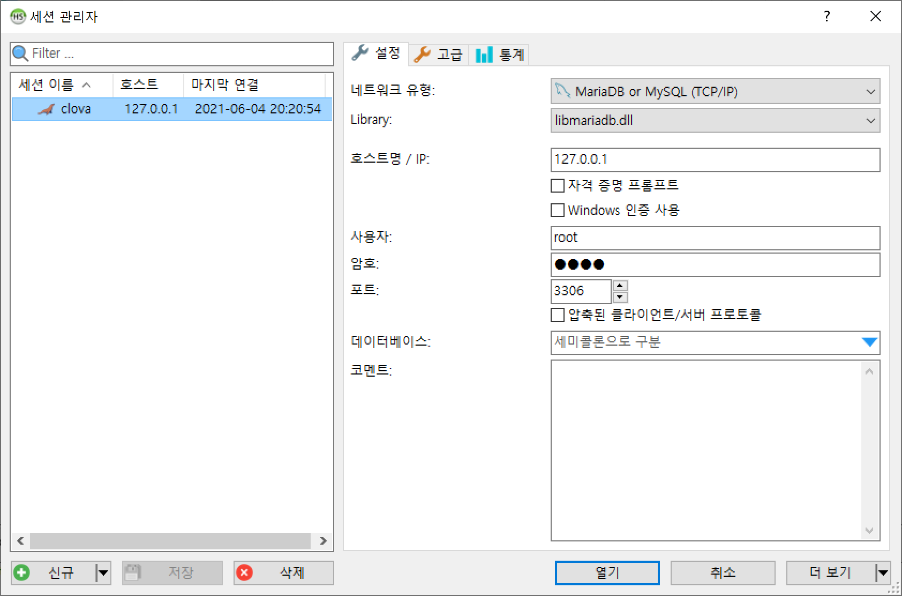
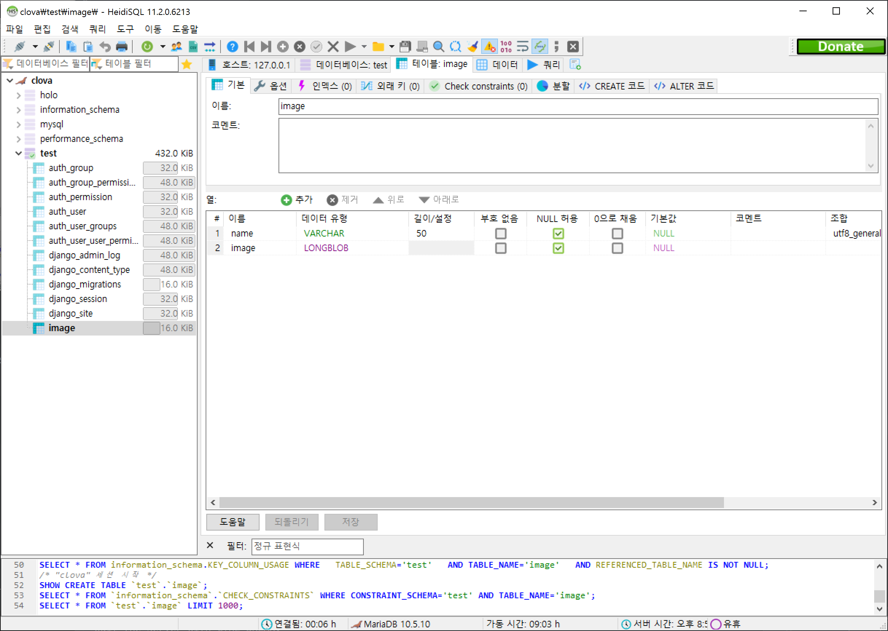

# hologram-project
홀로그램 제작 프로젝트입니다.

## Table of Contents

- [Requirements](#Requirements)
- [How-to-use](#How-to-use)
- [Credits](#Credits)
- [License](#License)

## Requirements

- Hardware (Developer environment)
  - CPU: Intel Core i7 9700
  - RAM: 32GiB
  - GPU: Nvidia Geforce RTX 3090
  - Storage: Samsung SSD 970 Pro 512GB
- Software
  - OS: Windows10
  - Miniconda (Python 3.8)
  - Pycharm
- Dependent packages
  - django
  - numpy
  - opencv-python
  - pillow
  - pymysql

## How-to-use

1. Clone this repository.

   ```bash
   git clone https://github.com/synml/hologram-project
   ```

2. Install Miniconda and MariaDB.

   - https://repo.anaconda.com/miniconda/Miniconda3-py39_4.9.2-Windows-x86_64.exe
   - https://mirror.yongbok.net/mariadb//mariadb-10.5.10/winx64-packages/mariadb-10.5.10-winx64.msi
   - Set MariaDB's default encoding to utf-8.
   - Remember root password of DBMS.

3. Create and activate a new virtual environment with Miniconda.

   ```bash
   conda update --a
   conda create -n [env_name, ex: holo] python=3.8
   conda activate [env_name, ex: holo]
   conda clean -a
   ```

4. Install dependent packages.

   ```bash
   conda install django numpy pillow
   pip install opencv-python pymysql
   ```

5. Open HeidiSQL and configure session.

   

6. Connect to MariaDB and create database (schema).

   

7. Create 'test' table.

   

8. Migrate django.

   ```bash
   python manage.py makemigrations
   python manage.py migrate
   ```

9. Run local server of django.

   ```bash
   python manage.py runserver
   ```

10. (Optional) Run on mobile web browser.

    ```bash
    start ngrok http 8000
    ```

11. Go to http://127.0.0.1:8000/, take and send photos.

12. Check saved image on database.

    ```bash
    python src/db_load_image2.py
    ```

## License

You can find more information in `LICENSE`.
